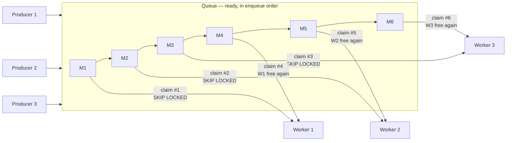
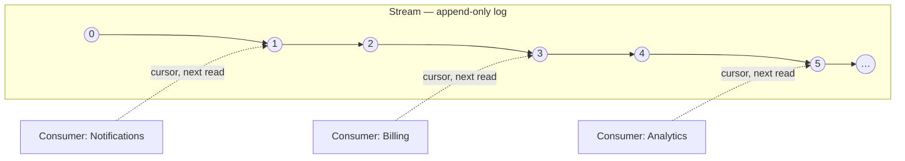

# Design

## Architecture

Junction is two engines behind one façade.

### `Junction.Queue` — competing consumers (fan-in)

`FOR UPDATE SKIP LOCKED` claims, fenced lease tokens, and a partial index on the hot table ensure
exactly one worker ever holds a given message. Any number of producers enqueue concurrently; ready
messages are claimed in priority-then-FIFO order, one at a time per claim — the claim order below is
global across every worker, not per-worker. There is no dispatcher or broker process in between:
each worker claims directly from the table.



Workers 1–3 each claim one message as soon as they're free; whichever worker's claim statement runs
next gets the next message, so the six claims interleave across all three rather than following any
one worker's own order. `SKIP LOCKED` guarantees the same message is never handed to two workers,
regardless of how many claim concurrently.

### `Junction.Stream` — fan-out

An append-only log with per-consumer durable offsets: every consumer reads the whole log
independently and can replay it. The log itself never changes because of a consumer reading it —
only that consumer's own cursor moves:



Three consumers, three independent cursors, one shared log: `Notifications` is about to read offset
1, `Billing` offset 3, `Analytics` offset 5 — none of them affect each other or the log, and a
consumer can `SeekAsync` its own cursor back to replay events the others already passed.

Both modules share:

- **One schema.** `junction` by default. Table names don't collide (`queues`, `messages`,
  `dead_letters`, `completed` vs. `streams`, `stream_events`, `consumer_cursors`,
  `stream_dead_letters`). Configurable for
  Queue (`QueueOptions.Schema`); fixed for Stream (`JunctionDbContext.Schema`) — moving Queue's schema
  elsewhere puts the two modules' tables in different schemas.
- **One connector abstraction.** `Junction.Connectors.IJunctionConnectionSource` is how a module gets
  the PostgreSQL connection it runs on — either an existing EF Core `DbContext` (so a message
  completion or an append commits together with your own writes, in the same transaction, with no
  outbox table needed) or a connection pool of its own. `AddQueue<TContext>` / `AddStream<TContext>` /
  `AddJunction<TContext>` use the former; `AddQueue` / `AddStream` / `AddJunction` (connection string
  only) use the latter.
- **One registration surface, one façade.** `AddJunction(...)` / `AddJunction<TContext>(...)` wire up
  both modules; `IJunctionClient` exposes them as `.Queue` and `.Stream`. Each module also has its own
  standalone registration (`AddQueue`, `AddStream`) for processes that only need one.
- **Push delivery** via a shared LISTEN/NOTIFY engine — see below.
- **One payload serializer abstraction** — see "Overriding the default serialization" below.

## Push delivery (LISTEN/NOTIFY)

Both modules support push delivery: idle workers/consumers wait on a PostgreSQL `NOTIFY` instead of
polling on a fixed interval, so new work is picked up as soon as a producer commits, and an idle
process issues no queries at all. It's advisory only — a missed notification simply falls back to the
configured poll interval, so correctness never depends on it.

Push delivery only shortens the idle wait. Claiming, polling, processing and committing all happen
exactly the same way regardless of whether a `NOTIFY` or the poll interval is what woke the process up
— there is no separate code path for "consuming a message that arrived via push."

Enable it with `QueueOptions.EnableNotifications` / `StreamOptions.EnablePushDelivery` (the latter is
on by default).

## Typed handlers and naming conventions

`IQueueMessageHandler<T>` and `ISingleMessageConsumer<T>` require you to state the queue/stream
(and, for streams, the consumer name) explicitly. `QueueHandler<T>` and `StreamConsumer<T>` are
abstract bases that default those names from `T` and the handler's own type:

- `QueueHandler<T>.Queue` defaults to `typeof(T).Name`.
- `StreamConsumer<T>.Stream` defaults to `typeof(T).Name`; `ConsumerName` defaults to `GetType().Name`
  — so two consumer classes reading the same stream get two independent cursors without either naming
  the other.

`QueueHandler<T>` and `StreamConsumer<T>` are ordinary generic classes implementing the existing
typed interfaces, registered the same way (`AddJunctionQueueWorker<TConcreteHandler>()` /
`AddJunctionStreamConsumer<TConcreteConsumer>()`) — `THandler`/`TConsumer` must be a closed type at the
registration call site (e.g. `OrderHandler`, not an open `QueueHandler<>`).

`IQueueProducer.EnqueueAsync<T>(value, queue: null, ...)` and
`IEventProducer.AppendAsync<T>(value, stream: null, ...)` are the matching producer-side convenience:
they serialize `value` through the module's `IPayloadSerializer` (JSON by default — see "Overriding
the default serialization" below) and default the queue/stream name (and the message/event `Type`) to
`typeof(T).Name`. The lower-level `EnqueueAsync(string queue, QueueMessageData, ...)` /
`AppendAsync(string stream, EventData, ...)` overloads cover anything that doesn't fit the "one queue
per type" default — a pre-encoded payload, per-message priority/delay/dedup key, etc.

## Overriding the default serialization

Both directions — producing (`EnqueueAsync<T>`, `AppendAsync<T>`) and consuming (`IQueueMessageHandler<T>`,
`QueueHandler<T>`, `ISingleMessageConsumer<T>`, `StreamConsumer<T>`) — go through the same
`Junction.IPayloadSerializer`, so a value round-trips through exactly one codec. The default is
`JsonPayloadSerializer`.

Replace it by passing your own implementation to `AddQueue`'s or `AddStream`'s `serializer` parameter
(also exposed on `AddJunction`, as `queueSerializer`/`streamSerializer`):

```csharp
services.AddQueue<AppDbContext>(serializer: new MessagePackPayloadSerializer());
services.AddStream(connectionString, serializer: new MessagePackPayloadSerializer());

// Or through the combined entry point:
services.AddJunction<AppDbContext>(
    queueSerializer: new MessagePackPayloadSerializer(),
    streamSerializer: new MessagePackPayloadSerializer());
```

Each module keeps its own instance — Queue and Stream can use different serializers, or the same one,
as needed.

To bypass serialization entirely for a specific message/event (raw bytes you've already encoded some
other way), use `QueueMessageData.FromBytes`/`EventData.FromBytes` with the lower-level
`EnqueueAsync(string queue, QueueMessageData, ...)`/`AppendAsync(string stream, EventData, ...)`
overloads instead of the typed `EnqueueAsync<T>`/`AppendAsync<T>`.

## Multiple queues or streams for one type

The type-derived defaults (`typeof(T).Name`) assume one queue/stream per business type. For more than
one — a priority lane, a per-tenant partition, a second stream feeding a different set of subscribers
— override the name explicitly on both ends of a given lane.

**Queue** — `EnqueueAsync<T>`'s `queue` parameter and `QueueHandler<T>.Queue` take the same string:

```csharp
await junction.Queue.Producer.EnqueueAsync(new Order { Id = 42 });                      // → queue "Order"
await junction.Queue.Producer.EnqueueAsync(new Order { Id = 43 }, queue: "Order.Priority");

public sealed class OrderHandler : QueueHandler<Order>
{
    // Queue defaults to "Order".
    public override Task HandleAsync(Order order, CancellationToken ct) { /* ... */ return Task.CompletedTask; }
}

public sealed class PriorityOrderHandler : QueueHandler<Order>
{
    public override string Queue => "Order.Priority";
    public override Task HandleAsync(Order order, CancellationToken ct) { /* ... */ return Task.CompletedTask; }
}

builder.Services.AddJunctionQueueWorker<OrderHandler>();
builder.Services.AddJunctionQueueWorker<PriorityOrderHandler>();
```

Each queue is claimed independently — `PriorityOrderHandler` never competes with `OrderHandler` for
the same message; they're two unrelated queues that happen to carry the same payload shape.

**Stream** — same idea with `AppendAsync<T>`'s `stream` parameter and `StreamConsumer<T>.Stream`. Keep
this distinct from `ConsumerName`:

- `Stream` picks *which log* a consumer reads. Different `Stream` values on two consumer classes means
  two independent event logs.
- `ConsumerName` picks *which cursor* a consumer reads that log with — ordinary fan-out. Two consumer
  classes with the *same* `Stream` but different `ConsumerName` both read the one log, each at their
  own pace; that's the default behavior of two consumer classes, no override needed.

```csharp
await junction.Stream.Producer.AppendAsync(new OrderPlaced { OrderId = 42 });                 // → stream "OrderPlaced"
await junction.Stream.Producer.AppendAsync(new OrderPlaced { OrderId = 42 }, stream: "OrderPlaced.Audit");

public sealed class BillingConsumer : StreamConsumer<OrderPlaced> { /* Stream = "OrderPlaced" */ }

public sealed class AuditConsumer : StreamConsumer<OrderPlaced>
{
    public override string Stream => "OrderPlaced.Audit";
}
```

## Configuration

`JunctionOptions` composes `Queue` (`QueueOptions`) and `Stream` (`StreamOptions`) unchanged:

```csharp
services.AddJunction<AppDbContext>(o =>
{
    o.Queue.LeaseDuration = TimeSpan.FromSeconds(45);
    o.Queue.MaxAttempts = 8;
    o.Stream.EnablePushDelivery = true;
    o.Stream.BulkInsertThreshold = 200;
});
```

### `QueueOptions`

| Name | Description | Default |
|---|---|---|
| `Schema` | PostgreSQL schema holding the queue tables (shared with Stream). | `"junction"` |
| `AutoCreateSchema` | Create the schema, tables and indexes on `InitializeAsync` if missing. | `true` |
| `ApplyStorageTuning` | Apply `fillfactor`/autovacuum tuning suited to a high-churn table. | `true` |
| `Completion` | What acknowledging a message does with its row (`Delete` or `Archive`). | `CompletionMode.Delete` |
| `LeaseDuration` | Visibility timeout: how long a claim holds a message before it's reclaimable. | `30s` |
| `MaxAttempts` | Delivery attempts allowed before a message is dead-lettered. | `5` |
| `RecoverOnClaim` | Recover expired leases inline when a claim finds nothing ready. | `true` |
| `Retry` | Backoff before a failed message's next attempt. | base `1s`, ×2 per attempt, capped `5min`, `0.2` jitter |
| `StarvationThreshold` | Longest a claimable message may be passed over by higher-priority work. `null` keeps priority absolute. | `null` |
| `MaintenanceInterval` | Interval of the maintenance loop (lease recovery + retention pruning). | `15s` |
| `AutoMaintenance` | Register the maintenance loop automatically alongside the first hosted worker. | `true` |
| `MetricsInterval` | Refresh interval for the gauge metrics (depth, oldest-ready age, dead letters, …). | `30s` |
| `ArchiveRetention` | How long completed messages are kept in the archive table. | `7 days` |
| `DeadLetterRetention` | How long dead-lettered messages are kept. | `30 days` |
| `EnableNotifications` | Wake idle workers via `LISTEN`/`NOTIFY` instead of polling only. | `false` |
| `ListenerConnectionString` | Connection string for the dedicated `LISTEN` connection, when using the EF connector. | `null` |

### `StreamOptions`

| Name | Description | Default |
|---|---|---|
| `AutoCreateSchema` | Create the schema, tables and indexes on first use if missing. | `true` |
| `EnableSensitiveDataLogging` | Enable EF Core sensitive data logging (payloads/parameters). Dev only. | `false` |
| `BulkInsertThreshold` | Batch size at/above which appends switch to a bulk-insert path for higher throughput. | `100` |
| `EnablePushDelivery` | Wake idle consumers via `LISTEN`/`NOTIFY` instead of polling only. | `true` |
| `PushReconnectDelay` | Delay before reopening the push-delivery connection after it drops. | `5s` |
| `EnableGroupCommit` | Coalesce single-event appends into grouped transactions via a background flusher. These appends run on the flusher's own connection and do not join a caller's ambient transaction, even under `AddStream<TContext>`. | `false` |
| `GroupCommitMaxBatch` | Maximum events coalesced into a single group-commit flush. | `1000` |
| `GroupCommitLinger` | How long the flusher waits for more events to accumulate before flushing a partial batch. | `2ms` |

## Not included

- .NET Aspire orchestration (`aspire/`).

## Verifying a build

Requires `clemkd/BulkForge` checked out as a sibling of this repo (`../BulkForge`) — see the
`ProjectReference` comment in `src/Junction/Junction.csproj`.

```bash
dotnet build
dotnet test tests/Junction.Tests                        # needs Docker (Testcontainers.PostgreSql)
dotnet run -c Release --project benchmarks/Junction.Benchmarks   # see docs/BENCHMARK.md
```
